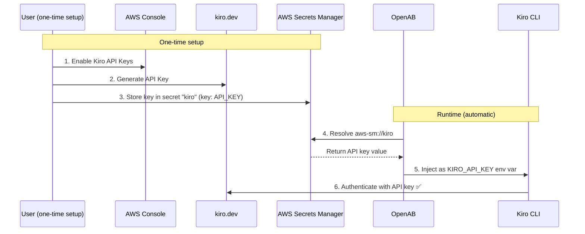

# Kiro CLI (Default Agent)

Kiro CLI is the default agent backend for OpenAB. It supports ACP natively — no adapter needed.

## Docker Image

The default `Dockerfile` bundles both `openab` and `kiro-cli`:

```bash
docker build -t openab:latest .
```

## Helm Install

```bash
helm repo add openab https://openabdev.github.io/openab
helm repo update

helm install openab openab/openab \
  --set agents.kiro.discord.botToken="$DISCORD_BOT_TOKEN" \
  --set-string 'agents.kiro.discord.allowedChannels[0]=YOUR_CHANNEL_ID' \
  --set image.tag=beta
```

### Image Tag

Use `--set image.tag=<version>` to set the image version globally.
The chart auto-appends `-<agent>` to produce the final tag (see [image-tags.md](image-tags.md) for full details).

| Tag | Resolves to | Description |
|-----|-------------|-------------|
| `beta` | `beta-kiro` | Floating beta channel (latest pre-release) |
| `0.9.0-beta.2` | `0.9.0-beta.2-kiro` | Pinned to exact version |
| `0.9` | `0.9-kiro` | Latest patch in minor (floating) |
| `stable` | `stable-kiro` | Floating stable channel |

To override a single agent's image instead of the global tag:
```bash
--set agents.kiro.image=ghcr.io/openabdev/openab:beta-kiro
```

> ⚠️ There is no `latest` tag. Use `beta` or `stable`, or pin to an exact version.

## Manual config.toml

```toml
[agent]
# command and args default from OPENAB_AGENT_COMMAND="kiro-cli acp --trust-all-tools"
# Only override if you need non-default behavior
```

## Authentication

### Recommended: API Key (No Login Required)

Kiro CLI supports API key authentication via the `KIRO_API_KEY` environment variable. This is the **recommended** approach — it requires no manual OAuth login and is fully managed by AWS Secrets Manager.

#### Setup Steps

1. **Enable API Keys in AWS Console** — Go to your AWS Console and search for "Kiro". Enable the API Keys feature. This option is only available through the AWS Console.
2. **Generate your API Key** — Go to [kiro.dev](https://kiro.dev), log in, and generate your API key.
3. **Store the key in AWS Secrets Manager** — Create a generic secret (e.g. secret name `kiro`) and store your API key as a key/value pair (e.g. key: `API_KEY`, value: your generated key).
4. **Configure AWS credentials** — Make sure your runtime environment has AWS CLI or AWS credentials configured so OpenAB can retrieve the secret.
5. **Configure `config.toml`** — Add the secret reference and environment variable:

```toml
[secrets.refs]
kiro_api_key = "aws-sm://kiro#API_KEY"

[agent]
env = { KIRO_API_KEY = "${secrets.kiro_api_key}" }
```

That's it — you're all set. No OAuth login required.

#### Architecture

```
┌─────────────────────────────────────────────────────────────────┐
│                        One-time Setup                           │
├─────────────────────────────────────────────────────────────────┤
│                                                                 │
│  ┌───────────────┐      ┌───────────┐      ┌────────────────┐   │
│  │  AWS Console  │      │ kiro.dev  │      │ AWS Secrets Mgr│   │
│  │               │      │           │      │                │   │
│  │ Enable Kiro   │      │ Generate  │      │ Secret: "kiro" │   │
│  │ API Keys      │      │ API Key   │─────▶│ Key: API_KEY   │   │
│  └───────────────┘      └───────────┘      │ Val: sk-xxxxx  │   │
│        ①                      ②            └───────┬────────┘   │
│                                                    │ ③          │
└────────────────────────────────────────────────────┼────────────┘
                                                     │
┌────────────────────────────────────────────────────┼────────────┐
│                     Runtime (automatic)            │            │
├────────────────────────────────────────────────────┼────────────┤
│                                                    │            │
│  ┌──────────────────────┐         ④ resolve        │            │
│  │       OpenAB         │◀──────────────────-──────┘            │
│  │                      │  aws-sm://kiro#API_KEY                │
│  │  config.toml:        │                                       │
│  │  env = { KIRO_API_KEY│                                       │
│  │    = "${secrets...}"}│                                       │
│  └──────────┬───────────┘                                       │
│             │ ⑤ inject env                                      │
│             ▼                                                   │
│  ┌──────────────────────┐         ⑥ authenticate                │
│  │     Kiro CLI         │────────────────────────▶ Kiro API     │
│  │                      │      KIRO_API_KEY ✅                  │
│  │  No login needed!    │                                       │
│  └──────────────────────┘                                       │
│                                                                 │
└─────────────────────────────────────────────────────────────────┘
```



#### How It Works

1. OpenAB starts and resolves `aws-sm://kiro#API_KEY` — fetches the `API_KEY` field from the AWS Secrets Manager secret named `kiro`.
2. The resolved value is injected into the agent container as the `KIRO_API_KEY` environment variable.
3. Kiro CLI detects `KIRO_API_KEY` and uses it directly — **no OAuth flow, no device code, no manual intervention**.

This makes the entire Kiro deployment **zero-touch** — fully automated with no login step required.

### Alternative: OAuth Device Flow (Legacy)

If you cannot use an API key, Kiro CLI falls back to the OAuth device code flow. The PVC persists tokens across pod restarts.

```bash
kubectl exec -it deployment/openab-kiro -- sh -c "$OPENAB_AGENT_AUTH_COMMAND"
```

Follow the device code flow in your browser, then restart the pod:

```bash
kubectl rollout restart deployment/openab-kiro
```

### Persisted Paths (PVC)

| Path | Contents |
|------|----------|
| `~/.kiro/` | Settings, skills, sessions |
| `~/.local/share/kiro-cli/` | OAuth tokens (`data.sqlite3` → `auth_kv` table), conversation history |

## Default Agent Resources

When Kiro CLI starts with the built-in `kiro_default` agent, it automatically reads the following resources into context:

| Resource | Description |
|----------|-------------|
| `AGENTS.md` | Agent coordination file (if exists in working dir) |
| `README.md` | Project readme (if exists in working dir) |
| `.kiro/skills/*/SKILL.md` | Skill files (local and global `~/.kiro/skills/`) |
| `.kiro/steering/**/*.md` | Steering docs (local and global, if exists) |
| `AmazonQ.md` | Legacy prompt file (if exists in working dir) |

> **Highly recommended:** `AGENTS.md` and `.kiro/steering/**/*.md` are the primary ways to give Kiro persistent memory. If you need Kiro to "memorize" something — best practices, guidelines, operational procedures, or project conventions — always first consider these two locations:
>
> - **`AGENTS.md`** — Place in the agent's working directory (default: `/home/agent`). Ideal for identity, role definition, and top-level instructions.
> - **`.kiro/steering/**/*.md`** — Organize guidelines by topic, e.g.:
>   - `.kiro/steering/operations/backup.md` — backup procedures
>   - `.kiro/steering/coding/style.md` — code style rules
>   - `.kiro/steering/security/secrets.md` — secret handling policy
>
> Both are read into context on every session start — no extra configuration needed.

### Customizing the Default Agent

You can override the default agent by creating a custom agent config:

```bash
# Inside the pod or on the PVC
cat > ~/.kiro/agents/my-agent.json << 'EOF'
{
  "name": "my-agent",
  "prompt": "You are a helpful assistant.",
  "tools": ["*"],
  "resources": [
    "file://AGENTS.md",
    "file://README.md",
    "skill://.kiro/skills/**/SKILL.md"
  ]
}
EOF

# Set as default
kiro-cli settings chat.defaultAgent my-agent
```

## Slash Commands

| Command | Purpose | Status |
|---------|---------|--------|
| `/models` | Switch AI model | ✅ Implemented |
| `/agents` | Switch agent mode | ✅ Implemented |
| `/cancel` | Cancel current generation | ✅ Implemented |

### `/models` — Switch AI Model

Kiro CLI returns available models via ACP `configOptions` (category: `"model"`) on session creation. User types `/models` in a thread → select menu appears → pick a model → OpenAB sends `session/set_config_option` (falls back to `/model <value>` prompt if not supported).

### `/agents` — Switch Agent Mode

Same mechanism as `/models` but for the `agent` category. Kiro CLI exposes modes like `kiro_default` and `kiro_planner` via `configOptions`.

### `/cancel` — Cancel Current Operation

Sends a `session/cancel` JSON-RPC notification to abort in-flight LLM requests and tool calls. Works immediately — no need to wait for the current response to finish.

**Note:** All slash commands only work in threads where a conversation is already active. If no session exists, they will prompt the user to start one first.

See [docs/slash-commands.md](slash-commands.md) for full details.

## Built-in Kiro CLI Commands

All built-in kiro-cli slash commands can be passed directly after an @mention:

```
@MyBot /compact
@MyBot /clear
@MyBot /model claude-sonnet-4
```

These are forwarded as-is to the kiro-cli ACP session as a prompt. Any command that kiro-cli supports in its interactive mode works here.
